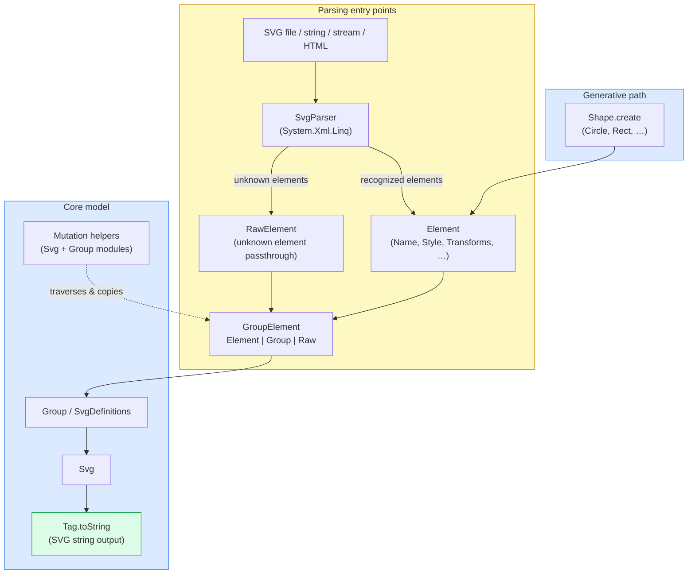
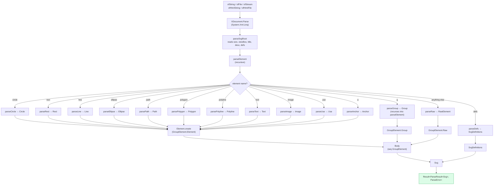

# Design: SVG Parsing & Mutation

## Overview

This document describes the architecture for SVG parsing and mutation in SharpVG. The design principle is: **parsing is an input path into the existing domain model**. Once parsed, everything uses the types and functions that already exist.

---

## Architecture



Parsing is an entry point into the existing model. `GroupElement` has three cases: `Element`, `Group`, and `Raw` (for unknown passthrough elements).

---

## Modules (Compilation Order)

The relevant portion of `SharpVG.fsproj` (tail end of the compile order):

```
...
Element.fs
Anchor.fs
Symbol.fs
Use.fs
RawElement.fs        ← unknown element passthrough
Group.fs             ← GroupElement DU (Element | Group | Raw) lives here
ClipPath.fs
Mask.fs
Pattern.fs
Marker.fs
SvgDefinitions.fs
Graphic.fs
Svg.fs               ← includes mutation helpers (mapElements, findById, etc.)
SvgParser.fs         ← XML → domain model
```

Mutation helpers are in `Svg.fs` (for `Svg`) and `Group.fs` (for `Group`). There is no separate `SvgMutation.fs` file.

---

## Types

### `RawElement`

Holds any SVG element the parser does not recognize, preserving it for round-trip:

```fsharp
type RawElement =
    {
        TagName: string
        Attributes: Attribute list
        Children: RawContent list
    }
and RawContent =
    | RawChild of RawElement
    | RawText of string
```

`RawElement.toString` emits the original XML faithfully.

### `ParseError`

```fsharp
type ParseError =
    {
        Message: string
        ElementName: string option
    }
```

### `ParseWarning`

```fsharp
type ParseWarning =
    {
        Message: string
        ElementName: string option
    }
```

### `ParseResult`

```fsharp
type ParseResult<'T> =
    {
        Value: 'T
        Warnings: ParseWarning list
    }
```

Top-level parse returns `Result<ParseResult<Svg>, ParseError>`.

### `GroupElement` DU

`GroupElement` is defined in `Group.fs` with three cases:

```fsharp
type GroupElement =
    | Group of Group
    | Element of Element
    | Raw of RawElement
```

`Body` (which is `seq<GroupElement>`) can therefore carry unknown elements. `Group.ToTag` pattern-matches on this DU with a `Raw` arm that calls `RawElement.toString`.

---

## `SvgParser` Module

Uses a three-layer approach — no new dependencies, idiomatic F# throughout:

- **XML layer:** `System.Xml.Linq` (`XDocument`/`XElement`) handles namespace resolution, encoding, and malformed-input rejection.
- **Element dispatch:** F# active patterns over `XElement` replace imperative `if`/`else` chains with a pattern-matching grammar.
- **Path data tokenization:** A regex tokenizer (`System.Text.RegularExpressions`) splits the `<path>` `d` attribute into a token list; a recursive F# function consumes it. Path data has no ambiguity or backtracking, so a parser combinator library adds no value.

```fsharp
module SvgParser =

    val ofString     : string -> Result<ParseResult<Svg>, ParseError>
    val ofFile       : string -> Result<ParseResult<Svg>, ParseError>
    val ofStream     : System.IO.Stream -> Result<ParseResult<Svg>, ParseError>
    val ofHtmlString : string -> Result<ParseResult<Svg>, ParseError> list
    val ofHtmlFile   : string -> Result<ParseResult<Svg>, ParseError> list
```

`ofHtmlString` / `ofHtmlFile` extract all `<svg>` elements from an HTML document (tries XML parse first, falls back to regex extraction for HTML5). Each embedded SVG produces one `Result` in the returned list.

### Internal parsing pipeline



```
parseElement : XElement -> ParseState -> GroupElement * ParseState
    ├── parseCircle
    ├── parseEllipse
    ├── parseRect
    ├── parseLine
    ├── parsePath
    ├── parsePolygon
    ├── parsePolyline
    ├── parseText
    ├── parseImage
    ├── parseUse
    ├── parseGroup (recursive — calls parseElement on children)
    ├── parseAnchor (wraps children as Anchor elements)
    ├── parseDefs (dispatches to gradient/clipPath/mask/pattern/marker/filter/symbol parsers)
    └── parseRaw (fallback — captures tag name, attributes, and direct children as-is)
```

### `ParseState`

Private accumulator for warnings threaded through the parse:

```fsharp
type ParseState =
    {
        Warnings: ParseWarning list
    }
```

### Attribute parsing helpers

```fsharp
// Internal helpers (not public):
val tryStyle      : XElement -> Style option      // parses presentation attrs + inline CSS style attr
val tryTransforms : XElement -> Transform seq
val tryAttr       : string -> XElement -> string option
val tryHref       : XElement -> string option     // checks href then xlink:href
val applyCommon   : XElement -> Element -> Element  // applies id, class, style, transform
```

`tryStyle` reads presentation attributes (`fill`, `stroke`, `stroke-width`, etc.) and the `style` attribute (CSS inline), merging both into a `Style` option.

`applyCommon` is called on every shape element after construction to apply shared attributes (`id`, `class`, `style`, `transform`).

### Recognized element dispatch

```fsharp
let parseElement (xel: XElement) (state: ParseState) : GroupElement * ParseState =
    match xel with
    | El "circle"   -> parseCircle xel state
    | El "ellipse"  -> parseEllipse xel state
    | El "rect"     -> parseRect xel state
    | El "line"     -> parseLine xel state
    | El "path"     -> parsePath xel state
    | El "polygon"  -> parsePolygon xel state
    | El "polyline" -> parsePolyline xel state
    | El "text"     -> parseText xel state
    | El "image"    -> parseImage xel state
    | El "use"      -> parseUse xel state
    | El "g"        -> let (group, s2) = parseGroup xel state
                       GroupElement.Group group, s2
    | El "a"        -> parseAnchor xel state
    | _             -> parseRaw xel state
```

---

## Mutation Helpers

Traversal and targeted mutation helpers live directly in `Svg.fs` and `Group.fs` (not a separate module):

```fsharp
module Svg =

    // Map every Element in body (recurses into groups, skips Raw nodes)
    val mapElements : (Element -> Element) -> Svg -> Svg

    // Map elements satisfying a predicate
    val mapElementsWhere : (Element -> bool) -> (Element -> Element) -> Svg -> Svg

    // Find first element by id (depth-first)
    val findById : ElementId -> Svg -> Element option

    // Find all elements matching predicate (depth-first)
    val findAll : (Element -> bool) -> Svg -> Element list

    // Replace element with given id
    val replaceById : ElementId -> Element -> Svg -> Svg

module Group =

    val mapElements : (Element -> Element) -> Group -> Group
    val findById    : ElementId -> Group -> Element option
```

These operate on `Body` (`seq<GroupElement>`), recursing into `Group` nodes and leaving `Raw` nodes unchanged.

---

## Round-trip Guarantee

For any SVG that contains only SharpVG-recognized elements:

```
parse(svg_string) |> Svg.toString ≈ svg_string
```

"≈" means semantically equivalent SVG (attribute order may differ; whitespace may normalize). Unknown elements (`RawElement`) reproduce their original XML verbatim.

For SVGs with unknown elements:

```
parse(svg_string) |> Svg.toString
```

preserves the unknown elements in their original position in document order.

---

## Compatibility

- **No breaking changes.** The `GroupElement.Raw` DU case was additive — all existing `match` expressions on `GroupElement` that use wildcard `_` continue to work.
- `Svg`, `Group`, `Element`, `Style`, `Transform` etc. are otherwise unchanged.
- `SvgParser` and the mutation helpers are purely additive.

---

## Implementation Status

### Done
- `RawElement` type + `GroupElement.Raw` case (`RawElement.fs`, `Group.fs`)
- `SvgParser.ofString` / `ofFile` / `ofStream` / `ofHtmlString` / `ofHtmlFile`
- Recognized shapes: `circle`, `rect`, `line`, `ellipse`, `path`, `polygon`, `polyline`, `text`, `image`, `g`, `use`, `a`
- Attribute parsing: `id`, `class`, `style` (presentation attrs + inline CSS), `transform`
- `<defs>` with `symbol`, `linearGradient`, `radialGradient`, `clipPath`, `mask`, `pattern`, `marker`, `filter`
- `xlink:href` normalization to `href`
- Unknown elements → `RawElement` passthrough
- Mutation helpers: `Svg.mapElements`, `Svg.mapElementsWhere`, `Svg.findById`, `Svg.findAll`, `Svg.replaceById`, `Group.mapElements`, `Group.findById`

### Not yet implemented
- Inline `<style>` block parsing → named `Style` records
- Strict parse mode (fail on unknown elements instead of producing `RawElement`)
- `SvgParser.ofSeq` (parse multiple SVG documents from a stream)

---

## Open Design Decisions

| Decision | Resolution |
|---|---|
| XML library | `System.Xml.Linq` (XDocument) — simpler, sufficient for expected sizes |
| Unknown attributes | Preserved in `RawElement.Attributes` — enables faithful round-trip |
| Inline `<style>` block | Not yet parsed — treated as `RawElement` passthrough |
| `href` normalization | Normalized to `href` (SVG 2 convention); `xlink:href` also checked |
| `GroupElement.Raw` | Added to existing DU — least disruption |
| Error handling | `Result<ParseResult<T>, ParseError>` — explicit, composable |
| Mutation helpers location | Implemented directly in `Svg` and `Group` modules; no separate `SvgMutation.fs` |
