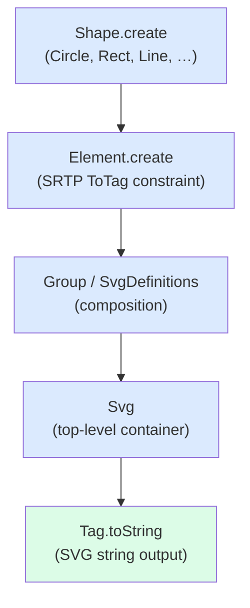
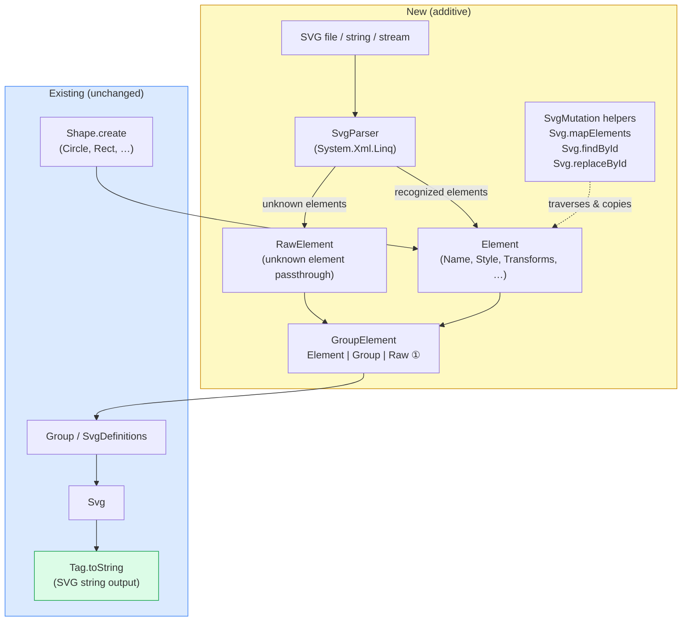
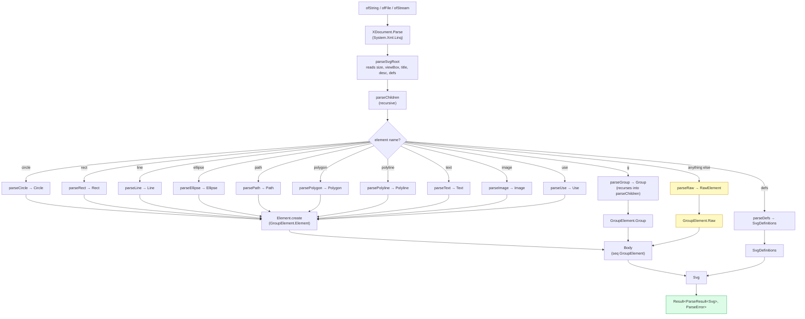

# Design: SVG Parsing & Mutation

## Overview

This document describes the architecture for adding SVG parsing and mutation to SharpVG. The design principle is: **parsing is an input path into the existing domain model**. Once parsed, everything uses the types and functions that already exist.

---

## Current Architecture



The current flow is strictly **generative** — data flows downward toward strings.

---

## Target Architecture



① `GroupElement.Raw` is the only change to an existing type — one new DU case added to carry `RawElement` through `Body`.

Parsing is a **new entry point** into the existing model. No existing types change except `GroupElement`.

---

## New Modules (Compilation Order)

These are inserted **after** all existing modules in `SharpVG.fsproj`:

```
...existing files...
SvgDefinitions.fs    (already last before Graphic/Svg)
Graphic.fs
RawElement.fs        ← NEW (unknown element passthrough)
SvgParser.fs         ← NEW (XML → domain model)
SvgMutation.fs       ← NEW (traversal/mutation helpers)
Svg.fs               (gains new helpers via partial module)
```

---

## New Types

### `RawElement`

Holds any SVG element the parser does not recognize, preserving it for round-trip:

```fsharp
type RawElement =
    {
        TagName: string
        Attributes: Attribute list
        Children: RawContent list
    }
and RawContent =
    | RawChild of RawElement
    | RawText of string
```

`RawElement.toString` emits the original XML faithfully.

### `ParseError`

```fsharp
type ParseError =
    {
        Line: int
        Column: int
        Message: string
        ElementName: string option
    }
```

### `ParseWarning`

```fsharp
type ParseWarning =
    {
        Line: int
        Column: int
        Message: string
    }
```

### `ParseResult`

```fsharp
type ParseResult<'T> =
    {
        Value: 'T
        Warnings: ParseWarning list
    }
```

Top-level parse returns `Result<ParseResult<Svg>, ParseError>`.

### Extended `GroupElement` DU

The existing `GroupElement` DU (`Group | Element`) gains one case:

```fsharp
// Current:
type GroupElement =
    | Group of Group
    | Element of Element

// After:
type GroupElement =
    | Group of Group
    | Element of Element
    | Raw of RawElement     ← NEW
```

This lets `Body` (which is `seq<GroupElement>`) carry unknown elements without breaking anything. `Body.toString` already pattern-matches on this DU — it gains a `Raw` arm that calls `RawElement.toString`.

---

## `SvgParser` Module

Uses a three-layer approach — no new dependencies, idiomatic F# throughout:

- **XML layer:** `System.Xml.Linq` (`XDocument`/`XElement`) handles namespace resolution, encoding, and malformed-input rejection.
- **Element dispatch:** F# active patterns over `XElement` replace imperative `if`/`else` chains with a pattern-matching grammar.
- **Path data tokenization:** A regex tokenizer (`System.Text.RegularExpressions`) splits the `<path>` `d` attribute into a token list; a recursive F# function consumes it. Path data has no ambiguity or backtracking, so a parser combinator library adds no value.

```fsharp
module SvgParser =

    val ofString : string -> Result<ParseResult<Svg>, ParseError>
    val ofFile   : string -> Result<ParseResult<Svg>, ParseError>
    val ofStream : System.IO.Stream -> Result<ParseResult<Svg>, ParseError>
```

### Internal parsing pipeline


parseElement : XElement -> ParseState -> GroupElement
    ├── parseCircle
    ├── parseRect
    ├── parseLine
    ├── parsePath
    ├── parseGroup (recursive)
    ├── parseDefs
    ├── ... (one function per recognized element)
    └── parseRaw   (fallback for unknown elements)
```

### `ParseState`

Accumulated warnings and a namespace map (for `xlink:`/`href` normalization):

```fsharp
type ParseState =
    {
        Warnings: ParseWarning list
        Namespace: string   // "http://www.w3.org/2000/svg"
    }
```

### Attribute parsing helpers

```fsharp
// Internal helpers (not public):
val tryFloat    : string -> XElement -> float option
val tryLength   : string -> XElement -> Length option
val tryPoint    : string -> string -> XElement -> Point option
val tryStyle    : XElement -> Style option          // parses presentation attrs
val tryTransform: XElement -> Transform seq
val tryId       : XElement -> ElementId option
```

`tryStyle` reads presentation attributes (`fill`, `stroke`, `stroke-width`, etc.) and the `style` attribute (CSS inline), merging both into a `Style` option. It records a warning for properties it doesn't understand.

### Recognized element dispatch

```fsharp
let private parseElement (xel: XElement) state : GroupElement * ParseState =
    match xel.Name.LocalName with
    | "circle"   -> parseCircle xel state   |> mapFst (Graphic.ofCircle >> Graphic.toElement >> GroupElement.Element)
    | "rect"     -> parseRect xel state     |> ...
    | "g"        -> parseGroup xel state    |> mapFst GroupElement.Group
    | "defs"     -> parseDefs xel state     // returns nothing in body (goes to SvgDefinitions)
    | _          -> parseRaw xel state      |> mapFst GroupElement.Raw
```

---

## `SvgMutation` Module (new public API)

Traversal and targeted mutation helpers. These are the functions that make parsed SVGs useful:

```fsharp
module Svg =   // extends existing Svg module

    // Map every Element in body (does not recurse into defs)
    val mapElements : (Element -> Element) -> Svg -> Svg

    // Map elements satisfying a predicate
    val mapElementsWhere : (Element -> bool) -> (Element -> Element) -> Svg -> Svg

    // Find first element by id
    val findById : ElementId -> Svg -> Element option

    // Find all elements matching predicate (depth-first)
    val findAll : (Element -> bool) -> Svg -> Element list

    // Replace element with given id
    val replaceById : ElementId -> Element -> Svg -> Svg

module Group =  // extends existing Group module

    val mapElements : (Element -> Element) -> Group -> Group
    val findById    : ElementId -> Group -> Element option
```

These operate on the `Body` type (which is `seq<GroupElement>`), recursing into `Group` nodes but leaving `Raw` nodes unchanged.

---

## `Body` Module Changes

`Body` is currently a type alias (`seq<GroupElement>`) without its own module. It gains a module:

```fsharp
module Body =
    let toString body =
        body
        |> Seq.map (function
            | GroupElement.Element e -> Element.toString e
            | GroupElement.Group g   -> Group.toString g
            | GroupElement.Raw r     -> RawElement.toString r)   // NEW arm
        |> String.concat ""

    let toStyles body = ...   // already exists, gains Raw arm (returns empty)

    let mapElements f body =
        body |> Seq.map (function
            | GroupElement.Element e -> GroupElement.Element (f e)
            | GroupElement.Group g   -> GroupElement.Group (Group.mapElements f g)
            | GroupElement.Raw r     -> GroupElement.Raw r)

    let findById id body =
        body |> Seq.tryPick (function
            | GroupElement.Element e when e.Name = Some id -> Some e
            | GroupElement.Group g   -> Group.findById id g
            | _                      -> None)
```

---

## Round-trip Guarantee

For any SVG that contains only SharpVG-recognized elements:

```
parse(svg_string) |> Svg.toString ≈ svg_string
```

"≈" means semantically equivalent SVG (attribute order may differ; whitespace may normalize). Unknown elements (`RawElement`) reproduce their original XML verbatim.

For SVGs with unknown elements:

```
parse(svg_string) |> Svg.toString
```

preserves the unknown elements in their original position in document order.

---

## Migration / Compatibility

- **No breaking changes.** `GroupElement` gains a new DU case — all existing `match` expressions on `GroupElement` that use wildcard `_` continue to work. Those that are exhaustive will get a compiler warning pointing them to add the `Raw` arm. (There are none in the current codebase — all matches already use `_`.)
- `Svg`, `Group`, `Element`, `Style`, `Transform` etc. are **unchanged**.
- The new `SvgParser` module is purely additive.

---

## Phased Delivery

```mermaid
gantt
    title SharpVG Parsing & Mutation — Phased Delivery
    dateFormat  X
    axisFormat Phase %s

    section Phase 1 — Core parsing
    RawElement type + GroupElement.Raw     :p1a, 0, 1
    SvgParser.ofString / ofFile            :p1b, 0, 1
    Basic shapes (circle rect line …)      :p1c, 0, 1
    Attribute parsing (id class style transform) :p1d, 0, 1
    Unknown elements → RawElement          :p1e, 0, 1

    section Phase 2 — Structural elements
    defs symbol gradient clipPath mask     :p2a, 1, 2
    pattern marker filter anchor           :p2b, 1, 2
    SvgParser.ofStream                     :p2c, 1, 2

    section Phase 3 — Mutation helpers
    Svg.mapElements / findById / replaceById :p3a, 2, 3
    Group.mapElements / findById           :p3b, 2, 3

    section Phase 4 — Advanced
    Inline style block parsing             :p4a, 3, 4
    xlink:href normalization               :p4b, 3, 4
    Strict parse mode                      :p4c, 3, 4
```



### Phase 1 — Core parsing (MVP)
- `RawElement` type + `GroupElement.Raw` case
- `SvgParser.ofString` / `ofFile`
- Recognized: `circle`, `rect`, `line`, `ellipse`, `path`, `polygon`, `polyline`, `text`, `image`, `g`, `use`
- Attribute parsing: `id`, `class`, `style` (presentation attrs), `transform`
- Unknown elements → `RawElement` passthrough

### Phase 2 — Definitions & structural elements
- Parse `<defs>`, `<symbol>`, `<linearGradient>`, `<radialGradient>`, `<clipPath>`, `<mask>`, `<pattern>`, `<marker>`, `<filter>`
- Parse `<a>` (Anchor)
- `SvgParser.ofStream`

### Phase 3 — Mutation helpers
- `Svg.mapElements`, `Svg.findById`, `Svg.replaceById`
- `Group.mapElements`, `Group.findById`

### Phase 4 — Advanced
- Inline `<style>` block parsing → named `Style` records
- `xlink:href` normalization
- Strict mode (fail on any unknown element rather than warn)
- `SvgParser.ofSeq` (parse multiple SVG documents from a stream)

---

## Open Design Decisions

| Decision | Option A | Option B | Recommendation |
|---|---|---|---|
| XML library | `System.Xml.Linq` (XDocument) | `System.Xml` (XmlReader, SAX) | XDocument — simpler, sufficient for expected sizes |
| Unknown attributes | Preserve in `RawElement.Attributes` bag | Drop silently | Preserve — enables faithful round-trip |
| Inline `<style>` | Opaque string passthrough | Parse CSS into `Style` records | Opaque string in Phase 1; parse in Phase 4 |
| `href` normalization | Always normalize to `href` | Preserve original | Normalize to `href` (SVG 2 convention) |
| `GroupElement.Raw` | Add to existing DU | Separate `ParsedBody` type | Add to existing DU — least disruption |
| Error handling | `Result` | `Option` + exceptions | `Result<ParseResult<T>, ParseError>` — explicit, composable |
