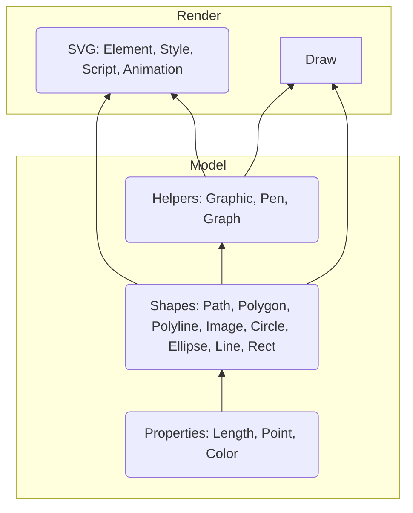

```mermaid
graph BT
    subgraph Model
        Properties(Properties: Length, Point, Color)
        Properties-->Shapes(Shapes: Path, Polygon, Polyline, Image, Circle, Ellipse, Line, Rect)
        Shapes-->Helpers(Helpers: Graphic, Pen, Graph)
    end
    subgraph Render
        Shapes-->Svg(SVG: Element, Style, Script, Animation)
        Helpers-->Svg
        Helpers-->Draw
        Shapes-->Draw
    end
```