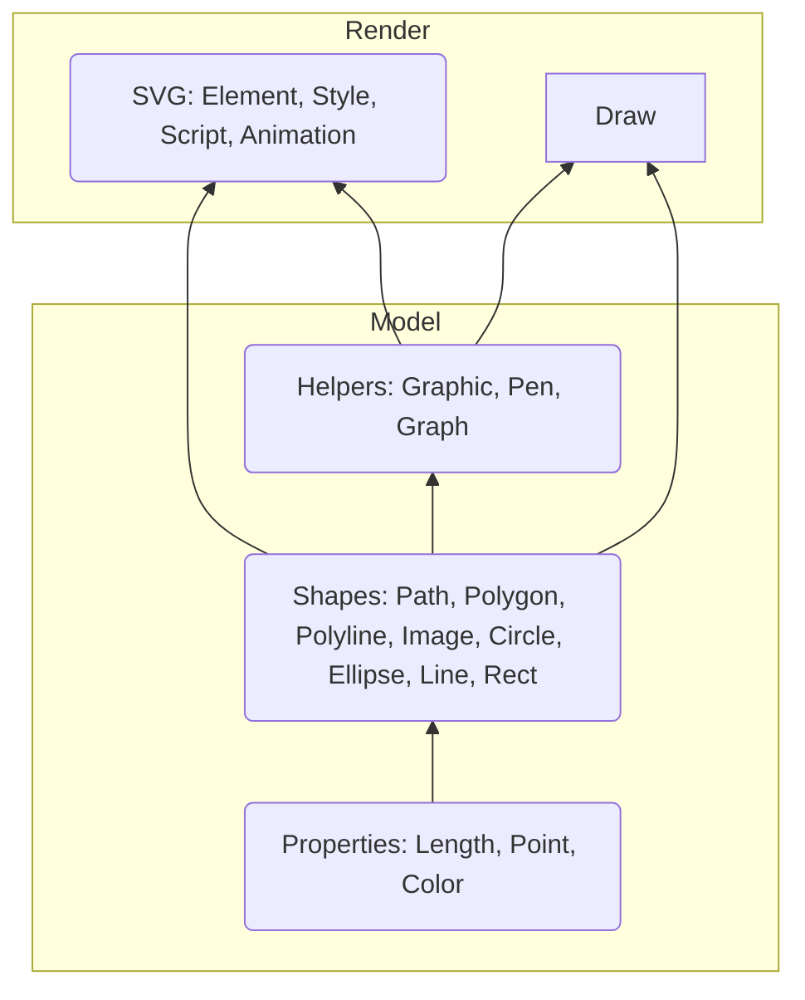

SharpVG is a library for generating SVG from F#. You build shapes and groups, wrap them in elements (with optional style, transform, and animation), then turn the result into an SVG document or HTML page. The diagram below shows how the main concepts fit together: properties and shapes form the model, and the render path goes through Element, Style, and Svg.

## SVG specification (alignment)

SharpVG output is intended to conform to the following W3C specifications. Refer to them for element and attribute semantics, and for validation:

- [Scalable Vector Graphics (SVG) 1.1 (Second Edition)](https://www.w3.org/TR/SVG11/) — elements, attributes, coordinate systems, painting, text.
- [SVG 2](https://www.w3.org/TR/SVG2/) — modern SVG (supersedes 1.1 where implemented).
- [SVG Animation (SMIL)](https://www.w3.org/TR/smil-animation/) — `animate`, `set`, `animateTransform`, `animateMotion`, and timing.

## See also

For contribution and example standards, see [standards.md](standards.md).

- [Styling](Styling.md) — Pen and Style (stroke/fill)
- [Element](Element.md) — Wrapping shapes and groups for output
- [Svg](Svg.md) — Building the SVG document and HTML
- [Group](Group.md) — Grouping elements
- [Transform](Transform.md) — Transforms on elements and groups
- [Animation](Animation.md) — SVG animation and timing