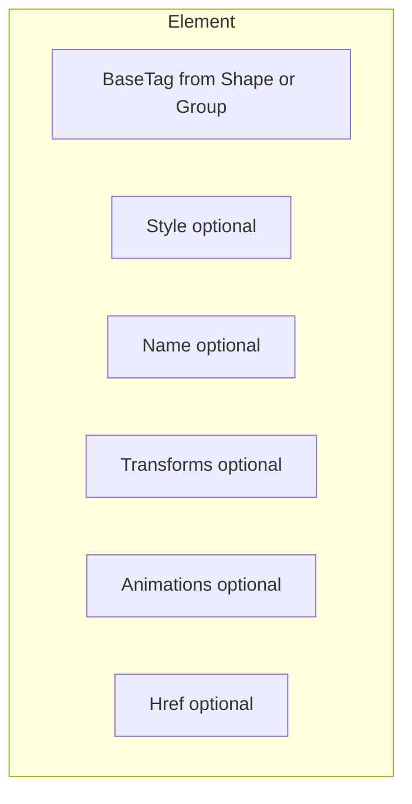

# Element

An **Element** is the renderable wrapper for a shape or a group. It carries the underlying tag (from the shape or group), plus optional style, id, transforms, and animations.

## Composition



- **BaseTag**: The shape or group provides this via `ToTag` (e.g. circle → `<circle ...>`, group → `<g ...>`).
- **Style**, **Name**, **Transforms**, **Animations**, **Href**: Optional; add with the `with*` functions.

## What can become an Element

Any type that has a static `ToTag` member can be passed to `Element.create` or `Element.createWithStyle`:

- All shapes: `Circle`, `Rect`, `Line`, `Ellipse`, `Polygon`, `Polyline`, `Path`, `Text`, `Image`
- **Group** — so `group |> Element.create` yields an element whose tag is `<g>...</g>`

## Creating elements

```fsharp
open SharpVG

// No style
let center = Point.ofInts (50, 50)
let radius = Length.ofInt 20
let circle = Circle.create center radius
let element = circle |> Element.create

// With style (name colors and pens to simplify; see Styling.md)
let strokeColor = Color.ofName Colors.Blue
let fillColor = Color.ofName Colors.Cyan
let strokePen = Pen.create strokeColor
let fillPen = Pen.create fillColor
let style = Style.createWithPen strokePen |> Style.withFillPen fillPen
let position = Point.ofInts (0, 0)
let area = Area.ofInts (40, 30)
let styledRect = Rect.create position area |> Element.createWithStyle style
```

## Modifiers

- **withStyle** — set or replace the element’s style.
- **withName** — set the element’s id (for `href="#id"` and animations targeting it).
- **withTransform** / **withTransforms** — set transform(s).
- **withAnimation** / **withAnimations** — add animation(s).
- **withHref** — set `href` (e.g. `#"targetId"` for an animation element that targets another).

Example: named circle with a transform and one animation:

```fsharp
let center = Point.ofInts (25, 25)
let radius = Length.ofInt 20
let translateX = Length.ofInt 10
let circle = Circle.create center radius
    |> Element.create
    |> Element.withName "myCircle"
    |> Element.withTransform (Transform.createTranslate translateX)
    |> Element.withAnimation someAnimation
```

## From element to output

Use [Svg](Svg.md): `element |> Svg.ofElement |> Svg.toHtml "Title"` to get an HTML document containing the SVG.
