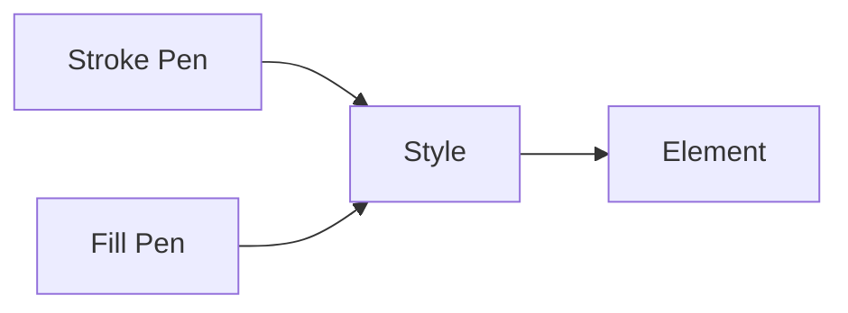

# Styling

SharpVG uses **Pen** for stroke and fill in most examples. Build a `Style` from one or two pens, then attach it to an element.

## Recommended: Pens

A **Pen** has color, opacity, and (for stroke) width. Use pens to avoid repeating the full `Style.create` signature.

### Creating pens

```fsharp
open SharpVG

// Name colors and dimensions first to simplify examples
let blue = Color.ofName Colors.Blue
let indigo = Color.ofName Colors.Indigo
let penWidth = Length.ofInt 3

// Default opacity 1.0 and width Length.one
let strokePen = Pen.create blue

// Custom opacity and width (e.g. for stroke)
let strokePen2 = Pen.createWithOpacityAndWidth indigo 1.0 penWidth

// Or use named pens: Pen.cyan, Pen.blue, Pen.black, etc.
let p = Pen.cyan
```

### Style from pens

- **Style.createWithPen** — builds a style with that pen as the **stroke** (fill = None).
- **Style.withFillPen** — add or replace **fill** with a pen’s color and opacity.
- **Style.withStrokePen** — set **stroke** from a pen on an existing style.

Example: rect with cyan fill and blue stroke:

```fsharp
let strokeColor = Color.ofName Colors.Blue
let fillColor = Color.ofName Colors.Cyan
let penWidth = Length.ofInt 3
let strokePen = Pen.createWithOpacityAndWidth strokeColor 1.0 penWidth
let fillPen = Pen.create fillColor
let style = Style.createWithPen strokePen |> Style.withFillPen fillPen
let position = Point.ofInts (10, 10)
let area = Area.ofInts (50, 50)
Rect.create position area
|> Element.createWithStyle style
|> Element.toString
```

### Styling flow



## Full control: Style.create

When you need explicit fill opacity, stroke width, and both colors in one call, use **Style.create**:

```fsharp
Style.create fill stroke strokeWidth opacity fillOpacity
```

See the `Style` type and module in the codebase for `withFill`, `withStroke`, `withOpacity`, and named styles (for CSS classes).
